# 1. 说明

java-all-call-graph-server 是 java-all-call-graph 的 Web 界面版本，提供操作界面便于对参数配置，简化操作步骤。通过本应用，用户可以通过友好的 Web 界面来管理 Java 代码静态分析和调用链生成的配置，而无需手动编写配置文件或使用命令行工具。

# 2. 环境依赖

需要使用 JDK8 及以上版本、需要使用 Gradle

部分 JDK8 版本在通过 Gradlew 编译时会失败，需要升级。

编译失败信息如下，从 Maven 仓库下载文件时失败：

```
FAILURE: Build failed with an exception.

* What went wrong:
A problem occurred configuring root project 'java-all-call-graph-server'.
> Could not resolve all files for configuration ':classpath'.
   > Could not resolve org.springframework.boot:spring-boot-gradle-plugin:2.7.18.
     Required by:
         project :
      > Could not resolve org.springframework.boot:spring-boot-gradle-plugin:2.7.18.
         > Could not get resource 'https://repo.maven.apache.org/maven2/org/springframework/boot/spring-boot-gradle-plugin/2.7.18/spring-boot-gradle-plugin-2.7.18.pom'.
            > Could not GET 'https://repo.maven.apache.org/maven2/org/springframework/boot/spring-boot-gradle-plugin/2.7.18/spring-boot-gradle-plugin-2.7.18.pom'.
               > The server may not support the client's requested TLS protocol versions: (TLSv1.2). You may need to configure the client to allow other protocols to be used. See: https://docs.gradle.org/7.6.6/userguide/build_environment.html#gradle_system_properties
                  > sun.security.validator.ValidatorException: PKIX path building failed: sun.security.provider.certpath.SunCertPathBuilderException: unable to find valid certification path to requested target
```

存在问题的版本为 jdk1.8.0_111。

安装更高版本的 JDK 后解决问题，可从 https://adoptium.net/zh-CN/temurin/releases?version=8 下载，例如 jdk1.8.0_462 版本。

# 3. 运行方式

## 3.1. 使用 IDE 运行

在 IDE（如 IntelliJ IDEA）中打开项目，运行 `JacgServerApplication` 主类即可启动应用。

## 3.2. 使用 Gradle 编译

执行以下命令编译打包：

```
gradlew bootJar
```

编译生成的 JAR 包位于 `build\libs` 目录，通过 `start.bat` 脚本启动应用。

# 4. 概念解释

## 4.1. 项目

每个项目配置了需要对哪些 Java 应用编译后的代码进行解析。项目包含以下属性：

| 属性 | 说明 | 示例 |
|------|------|------|
| 项目 ID | 使用当前时间精确到毫秒的字符串形式 | `20240226100000001` |
| 描述 | 项目的描述信息 | `订单系统调用链分析` |
| 创建时间 | 项目创建的时间戳 | `2024-02-26 10:00:00` |
| Java 代码路径 | 需要解析的 jar/war/class 文件或目录 | `/data/project/libs/` |

## 4.2. 模板

每个模板配置了需要对哪些类名方法生成向上或向下的完整方法调用链，或者再根据关键字生成调用堆栈。模板包含以下属性：

| 属性 | 说明 | 示例 |
|------|------|------|
| 模板 ID | 使用当前时间精确到毫秒的字符串形式 | `20240226100100001` |
| 所属项目 ID | 模板归属的项目 | `20240226100000001` |
| 描述 | 模板的描述信息 | `订单服务入口调用链` |
| 调用链方向 | 向上调用链或向下调用链 | `caller`（向下）或 `callee`（向上） |
| 创建时间 | 模板创建的时间戳 | `2024-02-26 10:01:00` |

# 5. 配置参数

## 5.1. 应用本身的配置参数

应用本身的配置参数位于 `conf/application.yml` 文件中：

- `server.port`：应用监听的 HTTP 端口，默认为 8080
- `jacgserver.output.root.path`：应用输出的根目录，默认为当前目录

## 5.2. 项目与模板的配置参数

当前应用对 java-callgraph2 与 java-all-call-graph 组件的功能与配置参数进行封装，页面上每一个显示的配置，对应以上组件中提供的一个配置文件，或配置文件中的一个参数。

配置参数类型包括：

| 配置类型 | 说明 |
|----------|------|
| 主配置参数 | 键值对形式的配置，如应用名称、线程数等 |
| 数据库配置参数 | 数据库连接相关配置，如是否使用 H2 数据库、数据库连接信息等 |
| List 配置参数 | 区分顺序的配置列表，如 jar 文件路径、关键字列表等 |
| Set 配置参数 | 不区分顺序的配置集合，如入口类/方法列表 |
| EL 表达式配置 | 用于复杂条件判断的表达式配置 |

# 6. 使用说明

## 6.1. 主页面

使用浏览器打开项目页面，默认地址为 http://127.0.0.1

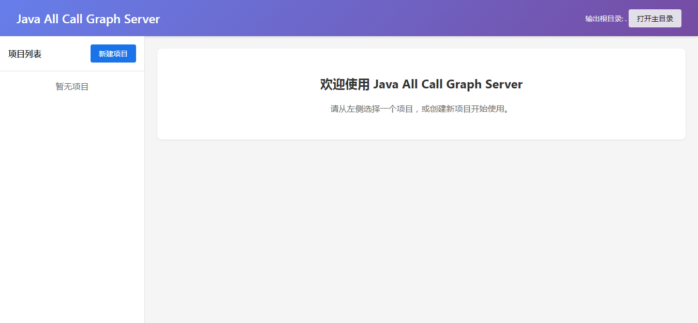

主页面显示项目列表，可以在此创建、编辑、复制、删除项目。

## 6.2. 项目操作

### 6.2.1. 创建项目

点击"新建项目"按钮可以创建项目，需要指定：

- **项目描述**：项目的描述信息，用于标识项目用途
- **Jar/Class 文件路径**：需要解析的 jar、war、jmod 文件或目录路径，每行一个路径

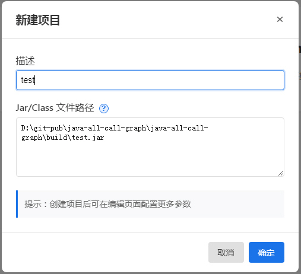

创建项目时，系统会自动：
- 生成项目配置目录
- 设置数据库配置默认值（默认使用 H2 数据库）
- 创建配置文件

### 6.2.2. 项目详情

项目完成创建后，点击项目可展示详情。

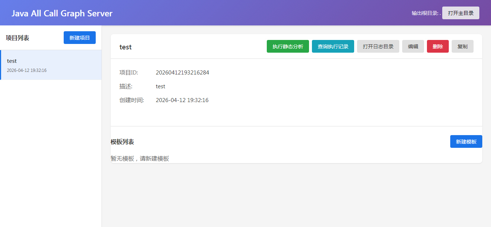

项目详情页面显示：
- 项目基本信息（项目 ID、描述、创建时间）
- 项目操作按钮（执行静态分析、编辑、删除、复制、新建模板、查询执行记录、打开日志目录）
- 项目下的模板列表

### 6.2.3. 项目执行与记录

点击"执行静态分析"按钮可对项目指定的 Java 代码进行分析。执行时：
- 系统会对指定的 jar/war/class 文件进行静态分析
- 分析结果写入数据库
- 生成执行记录

执行期间：
- 相关按钮会被禁用（编辑、删除、复制、新建模板等）
- 按钮显示"执行中。.."状态
- 执行完成后自动恢复按钮状态

点击"查询执行记录"按钮可以查看项目执行记录，包括执行时间、状态、耗时等信息。

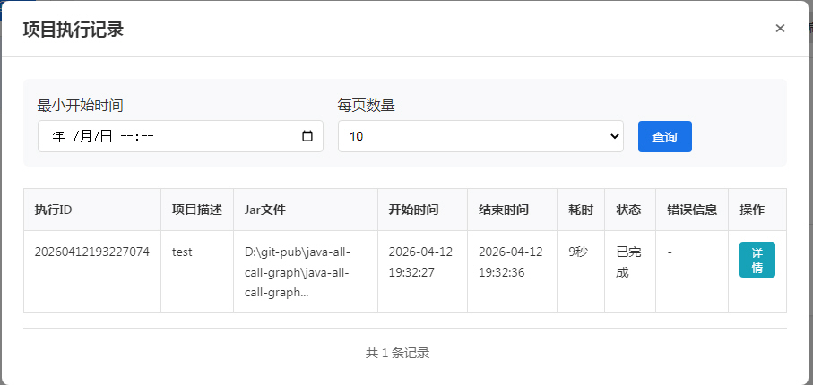

### 6.2.4. 项目配置参数编辑

点击"编辑"按钮可打开项目配置参数编辑页面。

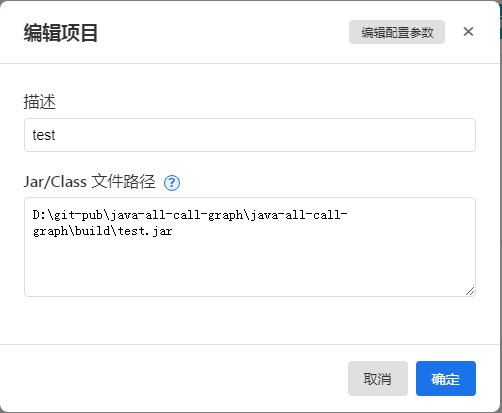

在编辑项目页面，可以修改：
- 项目描述
- Jar/Class 文件路径

点击"编辑项目"页面的"编辑配置参数"按钮可以编辑项目的详细配置参数，包括：

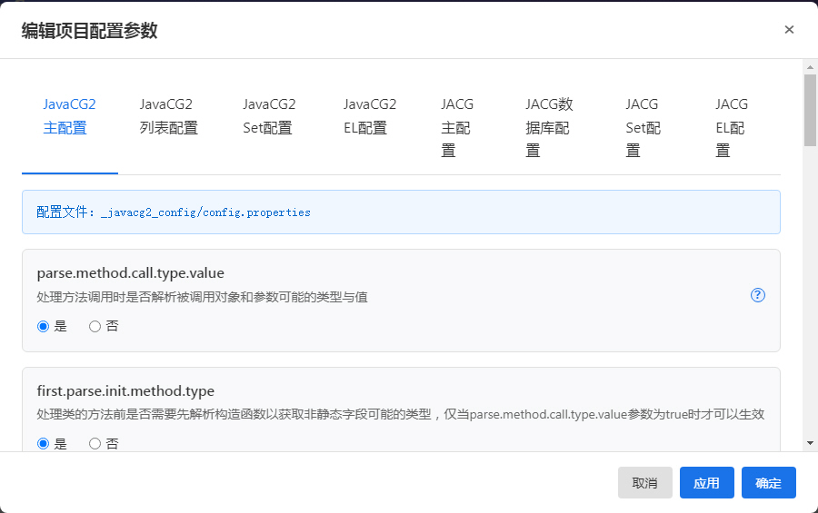

- **JavaCG2 主配置**：java-callgraph2 组件的主配置参数
- **JACG 主配置**：java-all-call-graph 组件的主配置参数
- **JACG 数据库配置**：数据库连接相关配置
- **列表配置**：区分顺序的配置参数列表
- **Set 配置**：不区分顺序的配置参数集合
- **EL 配置**：表达式配置参数

点击某个配置参数的问号按钮可以查看参数的详细说明。

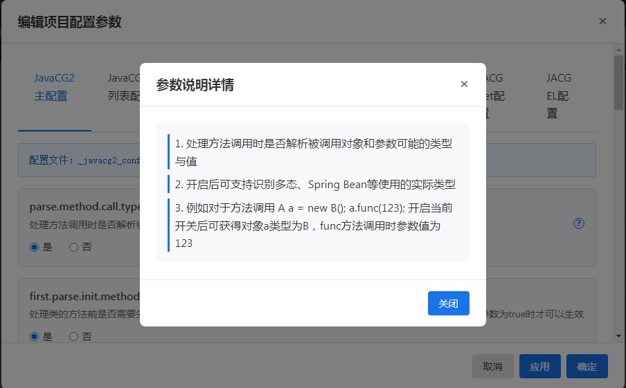

### 6.2.5. 表达式配置参数

通过标签页可以打开不同的配置参数，例如表达式相关配置参数。

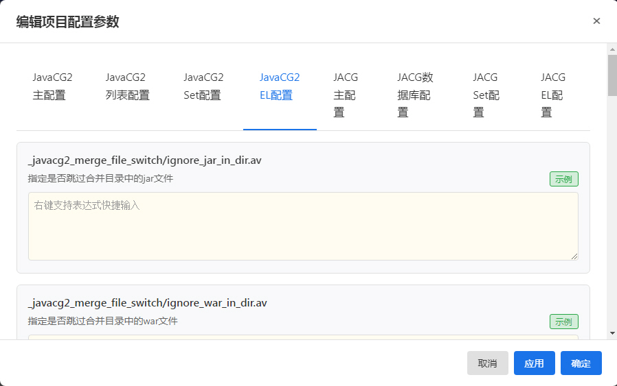

点击"示例"可查看表达式对应的详细说明，包括表达式语法和使用示例。

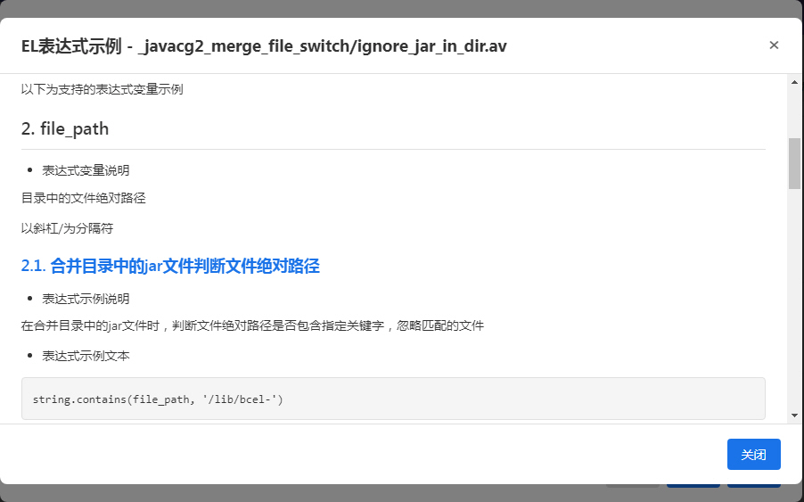

### 6.2.6. 表达式快捷输入菜单

在表达式文本框点击右键可以显示表达式快捷输入菜单，支持快速插入：
- 变量：当前表达式支持的变量
- 逻辑运算符：&&、||、!、()
- 比较运算符：==、!=、<、>、<=、>=
- 集合判断：include、!include
- 字符串方法：startsWith、endsWith、contains 等

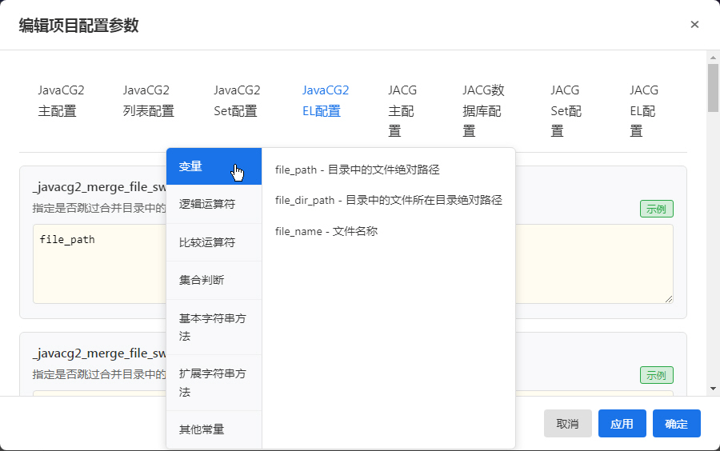

## 6.3. 模板操作

### 6.3.1. 创建模板

在某个项目内点击"新建模板"按钮可以创建模板，需要指定：

- **模板描述**：模板的描述信息
- **调用链方向**：
  - 向下调用链（caller）：查找指定方法调用的所有方法
  - 向上调用链（callee）：查找调用指定方法的所有方法
- **入口类/方法**：每行一个，格式为 `类名：方法名` 或完整方法签名
- **是否启用生成调用链根据关键字生成堆栈**：可选功能，启用后需要配置关键字

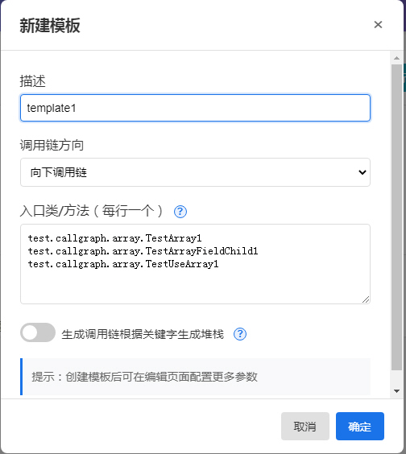

模板创建后会在项目中显示。

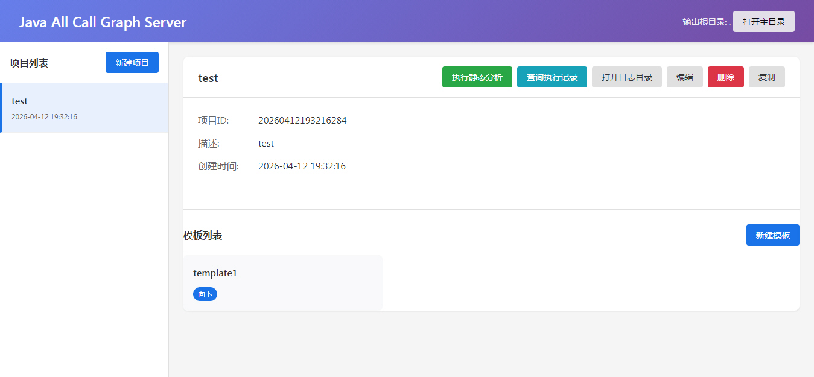

### 6.3.2. 模板详情

点击模板可以打开模板详情。

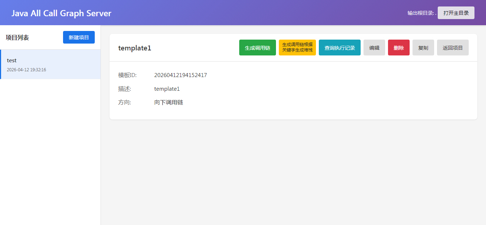

模板详情页面显示：
- 模板基本信息（模板 ID、描述、调用链方向、创建时间）
- 入口类/方法列表
- 关键字列表（如果启用）
- 模板操作按钮（生成调用链、生成调用链根据关键字生成堆栈、编辑、删除、复制、查询执行记录）

### 6.3.3. 模板执行与记录

点击"生成调用链"按钮：根据配置的入口类/方法，生成完整的方法调用链。

点击"生成调用链根据关键字生成堆栈"按钮：在生成调用链的基础上，根据配置的关键字筛选生成调用堆栈。

执行前系统会检查：
- 项目是否有成功的静态分析执行记录
- 关键字是否已配置（针对生成堆栈功能）

如果检查不通过，会提示相应的错误信息。

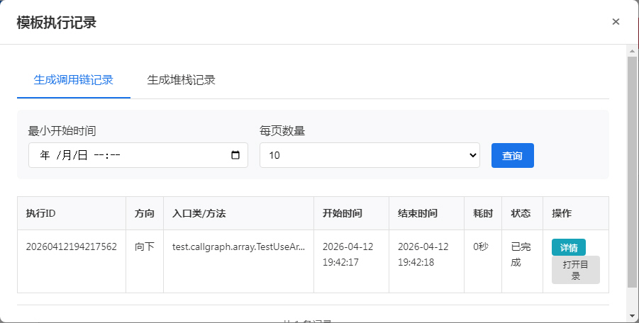

执行记录包括：
- 执行 ID
- 入口类/方法
- 关键字（针对生成堆栈记录）
- 执行时间
- 执行状态（执行中/已完成/失败）
- 执行耗时
- 输出目录路径

### 6.3.4. 模板配置参数编辑

点击"编辑"按钮可打开模板配置参数编辑页面。

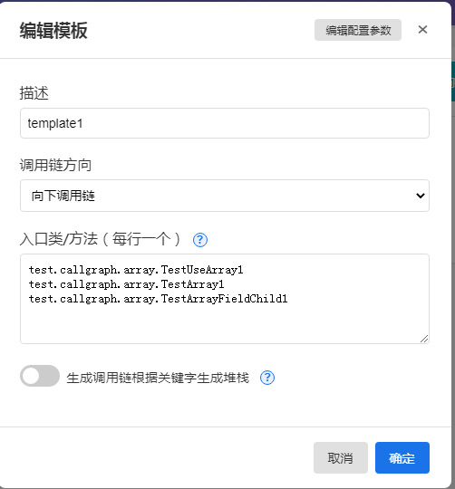

在编辑模板页面，可以修改：
- 模板描述
- 入口类/方法
- 是否启用生成调用链根据关键字生成堆栈
- 关键字列表

点击"编辑模板"页面的"编辑配置参数"按钮可以编辑模板的详细配置参数。

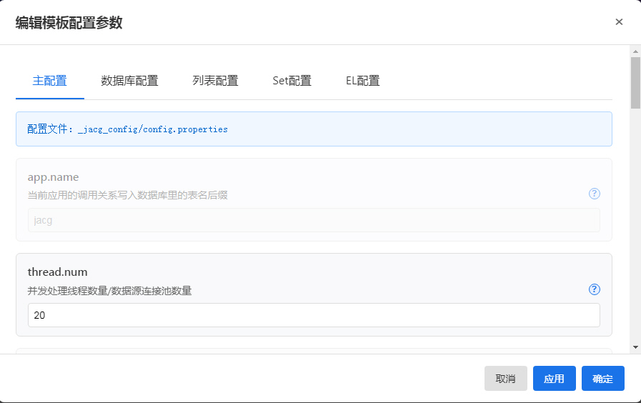

**注意**：模板的数据库配置会自动使用所属项目的数据库配置，在编辑页面显示为只读状态，并提示"模板会自动使用对应项目的数据库配置"。

模板支持的配置参数：
- **主配置**：JACG 主配置参数（部分参数不展示或只读）
- **数据库配置**：只读，自动使用项目配置
- **列表配置**：区分顺序的配置参数列表
- **Set 配置**：不区分顺序的配置参数集合
- **EL 配置**：表达式配置参数

## 6.4. 其他功能

### 6.4.1. 打开目录

在以下位置可以打开目录：
- 主界面顶部：打开应用根目录
- 项目详情页：打开项目的日志目录
- 执行记录列表：打开生成的调用链文件目录

**注意**：打开目录功能仅支持 Windows 操作系统。

### 6.4.2. 复制项目/模板

复制功能可以基于现有项目或模板创建新的项目或模板，复制时会复制所有配置参数。

### 6.4.3. 删除项目/模板

删除项目或模板时，会同时删除：
- 项目/模板的配置文件
- 项目下的所有模板（仅删除项目时）
- 相关的日志文件

**注意**：删除操作不可恢复，请谨慎操作。

# 7. 应用使用的目录与文件

## 7.1. 应用配置目录

应用配置目录位于 `{应用根目录}/conf/`，包含应用运行所需的配置文件：

```
{应用根目录}/conf/
├── application.yml              # 应用配置文件
└── log4j2.xml                   # 日志配置文件
```

**application.yml 主要配置项**：

| 配置项 | 说明 | 默认值 |
|--------|------|--------|
| `server.port` | 应用监听的 HTTP 端口 | 8080 |
| `jacgserver.output.root.path` | 输出根目录 | `./` |

**log4j2.xml 配置**：控制日志输出格式、级别和文件位置。

**注意**：使用 Gradle 编译打包后，需要手动创建 `conf` 目录并放入配置文件。应用启动时会通过 `-Dspring.config.additional-location` 和 `-Dlog4j2.configurationFile` 参数加载配置。

## 7.2. 输出根目录

输出根目录由配置参数 `jacgserver.output.root.path` 指定，默认为当前目录 `./`。

可在以下位置配置：
- `conf/application.yml` 文件中的 `jacgserver.output.root.path` 参数
- JVM 启动参数：`-Djacgserver.output.root.path=路径`
- 启动脚本参数：`start.bat -o 路径` 或 `start.bat --output 路径`

输出根目录是所有输出文件的基础目录，包括项目配置、日志、生成的调用链文件等。

## 7.3. 项目与模板配置文件

项目与模板的配置文件保存在输出根目录下的 `project_conf/` 目录中：

```
{输出根目录}/project_conf/
├── project.json                 # 项目列表配置文件，保存所有项目的基本信息
└── {项目 ID}/                    # 每个项目一个目录
    ├── config/                  # 项目配置文件（java-callgraph2 与 java-all-call-graph 组件的配置）
    ├── h2db/                    # 项目使用的 H2 数据库文件目录
    │   └── jacg.mv.db           # H2 数据库文件（静态分析结果）
    └── templates/               # 模板目录
        └── {模板 ID}/            # 每个模板一个目录
            └── config/          # 模板配置文件
```

## 7.4. H2 数据库文件

应用使用两类 H2 数据库文件：

### 7.4.1. 应用执行记录数据库

保存项目与模板的执行记录，位于 `{应用根目录}/h2db/record.mv.db`。

记录内容包括：
- 项目静态分析执行记录
- 模板生成调用链执行记录
- 执行状态、耗时、输出目录等信息

### 7.4.2. 项目静态分析数据库

每个项目使用独立的 H2 数据库，保存静态分析结果，位于 `{项目配置目录}/h2db/jacg.mv.db`。

数据库中保存的内容包括：
- 类信息
- 方法信息
- 方法调用关系
- 字段信息等

模板生成调用链时会读取所属项目的数据库。

## 7.5. 生成的调用链目录

调用链文件生成在输出根目录下：

| 目录 | 说明 |
|------|------|
| `_jacg_o_ee/` | 向上调用链输出目录（callee，查找调用指定方法的所有方法） |
| `_jacg_o_er/` | 向下调用链输出目录（caller，查找指定方法调用的所有方法） |

每个模板执行后会在对应目录下生成以执行 ID 命名的子目录，包含生成的调用链文件。

## 7.6. 日志目录

应用日志保存在 `{输出根目录}/log/` 目录下，按项目 ID 分组：

```
{输出根目录}/log/
└── {项目 ID}/                    # 每个项目一个目录
    ├── analysis.log             # 静态分析日志
    └── {模板 ID}/                # 每个模板一个目录
        └── callgraph.log        # 生成调用链日志
```

日志文件用于问题排查和执行过程追踪。

# 8. 注意事项

1. **执行顺序**：必须先对项目执行静态分析，才能对模板执行生成调用链操作
2. **并发控制**：项目执行静态分析时，相关操作会被禁止；模板执行时，模板相关操作会被禁止
3. **数据库配置**：项目与项目下所有模板使用相同的数据库配置，修改项目数据库配置会自动同步到所有模板
